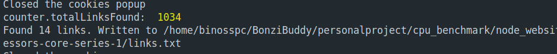
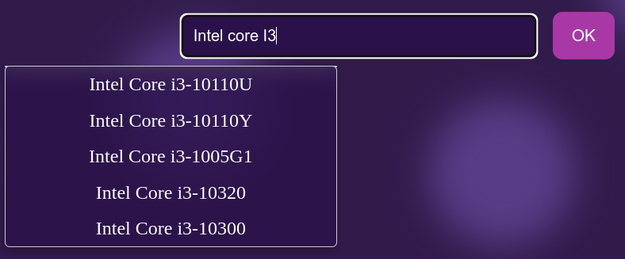
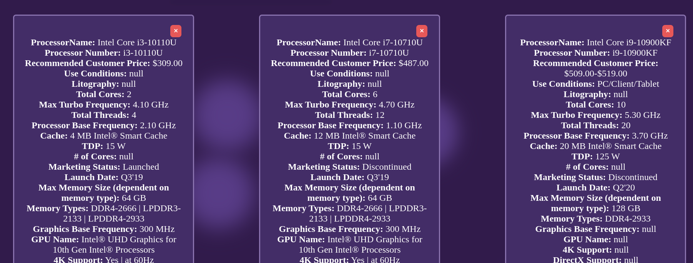

#[Intel CPU comparison 🔗](https://github.com/ExtraBinoss/Intel_Cpu_Comparaison)

---

## Goal of this project

The goal of this project is to compare the performance of different Intel processors. The data is scraped from the Intel website and stored in a database.

The user can then search for a processor and get a comparison of the performance of that processor with other processors.

It was made out of curiosity and to learn more about web scraping and databases.

---

## Library used

- Express
- Puppeteer
- Node.js

---

## How to run the project

1. Clone the repository

2. Install the dependencies

```bash
 $ npm install package.json
```

3. Run the server

```bash
nodemon cpu_compare.js
```

4. Open the browser and go to the following link

```bash
http://localhost:3001/
```

---

## Buttons and their functions

Crawler button:


This button triggers the web scraping process. It will get the links of all the processors from the Intel website and store them in the database.

New Scrape button:


Opens every link from the crawler, scrapes all the available processors from the Intel website, and stores them in the database.

What happens when clicking the New Scrape button:



Intel Downloader button: 


Downloads the processors from the links found in the scraping process and stores them in a folder. [This process takes about 30 minutes]

Csv Parser button:


Parses the downloaded processors and stores them in the database.
the file is located in parsed_processors.txt and contains everything the website needs to start comparing processors.

---

## Now lets compare processors !

Step 1 : Searching processors 



Step 2 : Add more processors to compare



## Author

- [Github](https://github.com/ExtraBinoss)
- Made during the second year at Epitech Technology